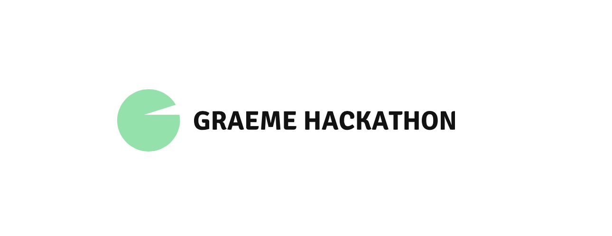

# hackathon 2021

Information for participants

**Data Sources**

Data sets to be used for the hack challenges can be found in the downloads folder

**Challenge Artifacts**

Any artifacts created by the teams can be submitted to the Jury. This can be done in the **Uploads** Area.

